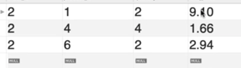

# PWM-MySQLFull-20190320

> *🧩 Programming with Mosh - MySQL Tutorial for Beginners [Full Course] (Mar 20, 2019)*

> *Link: https://www.youtube.com/watch?v=7S_tz1z_5bA*

> *Description: MySQL tutorial for beginners - Learn MySQL, the world's most popular open source database.*

> *📕Get my FREE SQL cheat sheet:
http://bit.ly/2JCO73l*

> *📔Scripts to create the databases in this course:
http://bit.ly/2LNdvCd*

> *If you're looking for a complete SQL tutorial for beginners with examples, this tutorial is a great way to learn SQL basics. Just follow through and you'll be able to write SQL queries in no time.*

> *SQL, short for Structured Query Language, is a language used by software developers, data scientists and anyone who works with data. With SQL, you can store data in relational databases and write queries to extract valuable information.*

> *There are various database management systems (DBMS) that support SQL but each product has its own implementation of SQL. In this course, we'll be using MySQL to learn SQL. MySQL is the most popular free and open-source database management system in the world. If you use a different DBMS (eg SQL Server), you can still benefit from this course as 90% of the skills you'll learn in this course can be transferred to other database management systems.*

---
<!--  -->

## Course Contents
1. 0:00:00 Introduction
1. 0:01:02 What is SQL?
1. 0:04:24 Cheat Sheet
1. 0:04:50 Installing MySQL on Mac
1. 0:09:48 Installing MySQL on Windows
1. 0:15:08 Creating the Databases for this Course
1. 0:23:40 The SELECT Statement
1. 0:29:30 The SELECT Clause
1. 0:38:18 The WHERE Clause
1. 0:43:35 The AND, OR, and NOT Operators
1. 0:51:38 The IN Operator
1. 0:54:41 The BETWEEN Operator
1. 0:56:53 The LIKE Operator
1. 1:02:31 The REGEXP Operator
1. 1:11:51 The IS NULL Operator
1. 1:14:18 The ORDER BY Operator
1. 1:21:23 The LIMIT Operator
1. 1:24:50 Inner Joins
1. 1:33:16 Joining Across Databases
1. 1:36:03 Self Joins
1. 1:40:17 Joining Multiple Tables
1. 1:47:03 Compound Join Conditions
1. 1:50:44 Implicit Join Syntax
1. 1:53:04 Outer Joins
1. 1:59:31 Outer Join Between Multiple Tables
1. 2:05:50 Self Outer Joins
1. 2:08:02 The USING Clause
1. 2:13:25 Natural Joins
1. 2:14:46 Cross Joins
1. 2:18:01 Unions
1. 2:26:29 Column Attributes
1. 2:29:54 Inserting a Single Row
1. 2:35:40 Inserting Multiple Rows
1. 2:38:58 Inserting Hierarchical Rows
1. 2:44:51 Creating a Copy of a Table
1. 2:53:38 Updating a Single Row
1. 2:57:33 Updating Multiple Rows
1. 3:00:47 Using Subqueries in Updates
1. 3:06:24 Deleting Rows
1. 3:07:48 Restoring Course Databases

---
## Table of Contents

- [PWM-MySQLFull-20190320](#pwm-mysqlfull-20190320)
  - [Course Contents](#course-contents)
  - [Table of Contents](#table-of-contents)
- [0:01:02 What is SQL?](#00102-what-is-sql)
  - [1 - What is a Database](#1---what-is-a-database)
  - [2 - Two Categories of DBMS (Relational vs Non Relational (NoSQL))](#2---two-categories-of-dbms-relational-vs-non-relational-nosql)
    - [2.1 - Relatational Databases (RDBMS)](#21---relatational-databases-rdbms)
    - [2.2 - Famous RDBMS](#22---famous-rdbms)
    - [2.3 Non-Relational Databases](#23-non-relational-databases)
  - [3 - History of SQL](#3---history-of-sql)
- [0:04:24 Cheat Sheet](#00424-cheat-sheet)
- [0:04:50 Installing MySQL on Mac](#00450-installing-mysql-on-mac)
  - [1 - Install](#1---install)
  - [2 - Setup](#2---setup)
- [0:09:48 Installing MySQL on Windows](#00948-installing-mysql-on-windows)
- [0:15:08 Creating the Databases](#01508-creating-the-databases)
  - [1 - Setup](#1---setup)
  - [2 - Executing a sql file in sql workbench](#2---executing-a-sql-file-in-sql-workbench)
  - [3 - Expanding sql_store](#3---expanding-sql_store)
    - [Structure](#structure)
    - [Viewing Tables](#viewing-tables)
- [0:23:40 The SELECT Statement](#02340-the-select-statement)
  - [1 - Selecting a Database](#1---selecting-a-database)
  - [2 - Displaying Customers Table](#2---displaying-customers-table)
    - [2.1 SELECT and FROM  Clause](#21-select-and-from--clause)
    - [2.2 WHERE Clause](#22-where-clause)
    - [2.3 ORDER BY Clause](#23-order-by-clause)
    - [2.4 Commenting Out - use two dashes "—"](#24-commenting-out---use-two-dashes-)
- [0:29:30 The SELECT Clause](#02930-the-select-clause)
  - [Aliases with AS](#aliases-with-as)
  - [DISTINCT Keyword - remove duplicates](#distinct-keyword---remove-duplicates)
- [0:38:18 The WHERE Clause](#03818-the-where-clause)
  - ["="](#)
  - [≠ or <>](#-or-)
  - [">, <,  ≥, ≤"](#----)
- [0:43:35 The AND, OR, and NOT Operators](#04335-the-and-or-and-not-operators)
- [0:51:38 The IN Operator](#05138-the-in-operator)
- [0:54:41 The BETWEEN Operator](#05441-the-between-operator)
- [0:56:53 The LIKE Operator](#05653-the-like-operator)
  - [1 - With Percent Sign %](#1---with-percent-sign-)
  - [5919 with "_" underscore](#5919-with-_-underscore)
- [1:02:31 The REGEXP Operator](#10231-the-regexp-operator)
  - [^ - beginning of the string](#---beginning-of-the-string)
  - [$ - end of the string](#---end-of-the-string)
  - [| - or / multiple search patterns](#---or--multiple-search-patterns)
  - [[] - Square Brackets](#---square-brackets)
  - [Supplying a range of characters](#supplying-a-range-of-characters)
  - [Exercise](#exercise)
- [1:11:51 The IS NULL Operator](#11151-the-is-null-operator)
  - [IS NULL](#is-null)
  - [IS NOT NULL](#is-not-null)
  - [Exercise](#exercise-1)
- [1:14:18 The ORDER BY Operator](#11418-the-order-by-operator)
  - [1.1 - using order by (ASC)](#11---using-order-by-asc)
  - [1.2 - descending order](#12---descending-order)
  - [2 - Sorting data by multiple columns](#2---sorting-data-by-multiple-columns)
  - [3 - Sorting without SELECT *](#3---sorting-without-select-)
  - [4 - Sorting With Math Operations and Aliases](#4---sorting-with-math-operations-and-aliases)
  - [5 - Sorting by the order of the columns you have selected in your query](#5---sorting-by-the-order-of-the-columns-you-have-selected-in-your-query)
  - [6 - Exercise: Try to replicate the results shown](#6---exercise-try-to-replicate-the-results-shown)
    - [6.1 - The Challenge](#61---the-challenge)
    - [6.2 - Making it Better](#62---making-it-better)
- [1:21:23 The LIMIT Operator](#12123-the-limit-operator)
  - [1 - Basic Usage](#1---basic-usage)
  - [2 - Paginating](#2---paginating)
  - [3 - Exercise - Top three customers (most points)](#3---exercise---top-three-customers-most-points)
- [1:24:50 Inner Joins](#12450-inner-joins)
  - [1 - INNER JOIN Basic Usage](#1---inner-join-basic-usage)
  - [2 - Selecting Fields to be shown with INNER JOIN-ing of two different tables](#2---selecting-fields-to-be-shown-with-inner-join-ing-of-two-different-tables)
  - [3 - Selecting field existing in both tables](#3---selecting-field-existing-in-both-tables)
  - [4 - Cleaner Code With Aliases](#4---cleaner-code-with-aliases)
  - [5 - Challenge - INNER JOIN order_items table and products table](#5---challenge---inner-join-order_items-table-and-products-table)
- [1:33:16 Joining Across Databases](#13316-joining-across-databases)
- [1 - Basic Usage](#1---basic-usage-1)
  - [2 - Another Way](#2---another-way)
- [1:36:03 Self Joins](#13603-self-joins)
  - [1 - Basic Demo](#1---basic-demo)
  - [2 - Cleaner Code of Above Example](#2---cleaner-code-of-above-example)
- [1:40:17 Joining Multiple Tables](#14017-joining-multiple-tables)
  - [1 - Basic Demo](#1---basic-demo-1)
  - [2 - Cleaner Code of Demo](#2---cleaner-code-of-demo)
  - [3 - Exercise](#3---exercise)
- [1:47:03 Compound Join Conditions](#14703-compound-join-conditions)
- [1:50:44 Implicit Join Syntax](#15044-implicit-join-syntax)
- [1:53:04 Outer Joins](#15304-outer-joins)
  - [1 - Basic Usage](#1---basic-usage-2)
  - [2 - Exercise](#2---exercise)
- [1:59:31 Outer Join Between Multiple Tables](#15931-outer-join-between-multiple-tables)
  - [1 - Basic Usage](#1---basic-usage-3)
  - [2 - Exercise](#2---exercise-1)
- [2:05:50 Self Outer Joins](#20550-self-outer-joins)
  - [1 - Basic Usage](#1---basic-usage-4)
- [2:08:02 The USING Clause](#20802-the-using-clause)
  - [1 - Basic Demo](#1---basic-demo-2)
  - [2 - With Multiple Joins](#2---with-multiple-joins)
  - [3 - With Composite Joins](#3---with-composite-joins)
  - [4 - Exercise](#4---exercise)
- [2:13:25 Natural Joins](#21325-natural-joins)
  - [1 - Basic Usage](#1---basic-usage-5)
- [2:14:46 Cross Joins](#21446-cross-joins)
  - [1 - Explicit Cross Join](#1---explicit-cross-join)
  - [2 - Implicit Cross Join](#2---implicit-cross-join)
  - [3 - Example](#3---example)
- [2:18:01 Unions](#21801-unions)
  - [1 - Basic Usage](#1---basic-usage-6)
  - [2 - Another Example](#2---another-example)
  - [3 - Reversing Order of Queries = Reversed order of results](#3---reversing-order-of-queries--reversed-order-of-results)
  - [4 - The name of the column of the unified queries is based on the first query](#4---the-name-of-the-column-of-the-unified-queries-is-based-on-the-first-query)
  - [5 - Exercise](#5---exercise)
    - [Another Example](#another-example)
- [2:26:29 Column Attributes](#22629-column-attributes)
  - [1 - DataTypes](#1---datatypes)
  - [2 - Attributes](#2---attributes)
- [2:29:54 Inserting a Single Row](#22954-inserting-a-single-row)
  - [1 - Basic Usage](#1---basic-usage-7)
  - [2 - With Explicitly Stating Columns](#2---with-explicitly-stating-columns)
- [2:35:40 Inserting Multiple Rows](#23540-inserting-multiple-rows)
  - [1 - Basic Usage](#1---basic-usage-8)
  - [2 - Exercise - Insert 3 rows in the products table](#2---exercise---insert-3-rows-in-the-products-table)
- [2:38:58 Inserting Hierarchical Rows](#23858-inserting-hierarchical-rows)
  - [1 - Basic Usage](#1---basic-usage-9)
- [2:44:51 Creating a Copy of a Table](#24451-creating-a-copy-of-a-table)
  - [1 - Basic Usage](#1---basic-usage-10)
  - [2 - Truncating Table](#2---truncating-table)
  - [3 - Copy some records to another table](#3---copy-some-records-to-another-table)
  - [4 - Exercise](#4---exercise-1)
- [2:53:38 Updating a Single Row](#25338-updating-a-single-row)
  - [1 - Basic Usage](#1---basic-usage-11)
  - [2 - Setting to Default and Null Values](#2---setting-to-default-and-null-values)
  - [3 - With Math Operations](#3---with-math-operations)
- [2:57:33 Updating Multiple Rows](#25733-updating-multiple-rows)
  - [1 - Basic Usage](#1---basic-usage-12)
  - [2 - Exercise](#2---exercise-2)
- [3:00:47 Using Subqueries in Updates](#30047-using-subqueries-in-updates)
  - [1 - Basic Usage](#1---basic-usage-13)
  - [2 - With Multiple records](#2---with-multiple-records)
  - [3 - Exercise](#3---exercise-1)
- [3:06:24 Deleting Rows](#30624-deleting-rows)
  - [1 - Basic Usage](#1---basic-usage-14)
- [3:07:48 Restoring Course Databases](#30748-restoring-course-databases)
  - [SKIP](#skip)

---

# 0:01:02 What is SQL?

## 1 - What is a Database


- Collection of data  stored in format that can easily be accessed.
- In order to manage databases, we use a software app called "database management system" (DBMS)
- We connect to our DBMS and give it instructions to query and modifying data.
- DBMS will execute our instructions and send results back.

## 2 - Two Categories of DBMS (Relational vs Non Relational (NoSQL))


### 2.1 - Relatational Databases (RDBMS)

- We store data in tables that are linked to each other using relationships
- Each table stores data about a specific type of object
- SQL is a language used to work with these relational types of DBMS

### 2.2 - Famous RDBMS

- MySQL
- SQL Server (Microsoft)
- Oracle

Each RDBMS has different flavor of SQL. but all of these has very similar implementation of SQL according to the standard SQL specification

### 2.3 Non-Relational Databases

- No Tables and relationships
- Don't understand SQL

## 3 - History of SQL

- Invented by IBM in the 70s and was initially called SQUEL (Structured English Query Language)
- changed to SQL and removed "English / E" since SQUEL was a trademark of an airplane company
- Most Non English Countries call it just SQL instead of SQUEL

---

# 0:04:24 Cheat Sheet

doesnt work ?

---

# 0:04:50 Installing MySQL on Mac

## 1 - Install

1. Go to MySQL.com

    [MySQL](https://mysql.com)

2. Go to downloads
3. find community downloads
4. find community server for macos, download
5. double click on wizard then do stuff
6. Go back to downloads and find MySQL Workbench then download that

## 2 - Setup

- Open MySQL Workbench
- delete the 3306 connection when new


- Test Connection then remember the password you set when you setting it up with the wizard
- then click okay the save the instance
- to open sql editor, just click on that instance

---

# 0:09:48 Installing MySQL on Windows

SKIP

---

# 0:15:08 Creating the Databases

## 1 - Setup

Download Link of Course Materials: 

[YouTube](https://www.youtube.com/redirect?event=video_description&redir_token=QUFFLUhqa05OenNISjNDcVBCUnVuSjBUdTI5Y1dqMGwzUXxBQ3Jtc0tsNURhZXFyOFVhN2FudTQ4TXo5VVh1M2xpZ28tM0g2Z185YnRDNmdPWEl1LW0tNE00Z19NaFZxZk5KckxxOHBOVnBlTHVsNEM1WEpNSXpybnExUUs2SnJGMmlCbV9OckZacVNOV013U2Y0WnhzNThUbw&q=http%3A%2F%2Fbit.ly%2F2LNdvCd)

^^ seen at vid description

## 2 - Executing a sql file in sql workbench

then import in the create-database sql to our sql editor by clicking 


the second icon to teh left

then to run the code, you run the lightning icon


then at schemas hit the reload icon to sync the changes from the instructions when we run the thunder icon


## 3 - Expanding sql_store

### Structure

1. Tables - where we store data
2. Views - Virtual Cables, combine data from multiple tables and put them in a view. powerful when creating reports
3. Stored Procedures
4. Functions - little programs with stored inside our databases for querying data

    Ex: if we have a store procedure for getting all customers in a given city, then this will return all those cutomers

### Viewing Tables


hover above a table say customers, then you should see three icons. click the third one to see the table view


# 0:23:40 The SELECT Statement

## 1 - Selecting a Database

to select a database, say sql_store, we say

```sql
USE sql_store
```

you can see after executing with lightning icon, the sql_store name will turn bold

## 2 - Displaying Customers Table

### 2.1 SELECT and FROM  Clause

```sql
USE sql_store;

SELECT *
FROM customers
```

dont forget semicolons


Instead of Executing with lightning icon, you can Shift+Command+Enter

this select statement has two clauses: select and from clause. there are other clauses taht can be used to filter and sort data.

### 2.2 WHERE Clause

```sql
USE sql_store;

SELECT *
FROM customers
WHERE customer_id = 1
```


### 2.3 ORDER BY Clause


### 2.4 Commenting Out - use two dashes "—"

like the image above where we commented out our WHERE Clause statement

# 0:29:30 The SELECT Clause

aside from just using "*" to get all data, you can select what kind of data fields / columns you want to query for

```sql
SELECT first_name, last_name
FROM customers
```


if you made last_name first before first_name, the order of columns will be different

You can also do math operations along with gemdas stuff:

```sql
SELECT first_name, last_name, points, points+10
FROM customers
```


You can also place select in multiline like this

```sql
SELECT 
	first_name, 
    last_name, 
    points, 
    points*10+100
FROM customers
```

## Aliases with AS

```sql
SELECT 
	first_name, 
    last_name, 
    points, 
    (points+10)*100 AS discount_factor
FROM customers
```

if you want to add space instead of underscore, you either use single or double quotes 

```sql
SELECT 
	first_name, 
    last_name, 
    points, 
    (points+10)*100 AS "discount factor"
FROM customers
```

## DISTINCT Keyword - remove duplicates

```sql
SELECT DISTINCT state
FROM customers
```

# 0:38:18 The WHERE Clause

## "="

```sql
SELECT *
FROM customers
WHERE state = "va"
```

## ≠ or <>

```sql
SELECT *
FROM customers
-- WHERE state <> "va"
WHERE state != "va"
```

## ">, <,  ≥, ≤"

```sql
SELECT *
FROM customers
WHERE birth_date > '1990-01-01'
```

# 0:43:35 The AND, OR, and NOT Operators

```sql
SELECT *
FROM customers
-- WHERE birth_date > '1990-01-01' AND points > 1000
WHERE birth_date > '1990-01-01' 
	OR points > 1000
    AND state = 'VA'
```

similar to gemdas, AND will be higher order, likewise you can use parenthesis and space it out to make it readable

```sql
SELECT *
FROM customers
-- WHERE birth_date > '1990-01-01' AND points > 1000
WHERE birth_date > '1990-01-01' 
	OR (points > 1000 AND state = 'VA')
```

you also have the not operator

```sql
SELECT *
FROM customers
WHERE NOT (birth_date > '1990-01-01' 
	OR (points > 1000 AND state = 'VA'))
```

Another Example:

```sql
USE sql_store; 

SELECT * FROM order_items
WHERE order_id = 6 
	AND (unit_price*quantity > 30)
```

# 0:51:38 The IN Operator

instead of writing all of these separate expressions, you can shorthand the same instructions using IN

```sql
SELECT * FROM customers
WHERE state = 'VA' OR state = "GA" OR state = "FL"
```

with in: like this

```sql
SELECT * FROM customers
WHERE state IN ('VA',"GA","FL")
```

outside of those states: NOT IN

```sql
SELECT * FROM customers
-- WHERE state IN ('VA',"GA","FL")
WHERE state NOT IN ('VA',"GA","FL")
```

another example

```sql
SELECT * FROM products
WHERE quantity_in_stock IN (49,39,72)
```

# 0:54:41 The BETWEEN Operator

longcut

```sql
SELECT * FROM customers
WHERE points >= 1000 AND points <= 3000
```

shortcut with Between Operator

```sql
SELECT * FROM customers
-- WHERE points >= 1000 AND points <= 3000
WHERE points BETWEEN 1000 AND 3000
```

Another Example:

```sql
SELECT * FROM customers
WHERE birth_date BETWEEN "1990-01-01" AND "2000-01-01"
```

# 0:56:53 The LIKE Operator

- % represent any number of characters
- _ to represent a single character

## 1 - With Percent Sign %

similar to includes, b% means anything starting with b

```sql
SELECT * FROM customers 
WHERE last_name LIKE 'b%'
```

have b anywhere in their last name

```sql
SELECT * FROM customers 
-- WHERE last_name LIKE 'b%'
WHERE last_name LIKE '%b%'
```

last names ending with y

```sql
SELECT * FROM customers 
-- WHERE last_name LIKE 'b%'
-- WHERE last_name LIKE '%y'
WHERE last_name LIKE '%b%'
```

## 5919 with "_" underscore

```sql
SELECT * FROM customers 
-- WHERE last_name LIKE 'b%'
-- WHERE last_name LIKE '%y'
-- WHERE last_name LIKE '%b%'

-- WHERE last_name LIKE '_____y'
WHERE last_name LIKE 'b____y'
```

# 1:02:31 The REGEXP Operator

This one executes the same result

```sql
SELECT * FROM customers 
-- WHERE last_name LIKE '%field%'
WHERE last_name REGEXP 'field'
```

## ^ - beginning of the string

This means that our last name must start with "field"

```sql
SELECT * FROM customers 
-- WHERE last_name LIKE '%field%'
-- WHERE last_name REGEXP 'field'
WHERE last_name REGEXP '^field'
```

## $ - end of the string

```sql
SELECT * FROM customers 
-- WHERE last_name LIKE '%field%'
-- WHERE last_name REGEXP 'field'
-- WHERE last_name REGEXP '^field'
WHERE last_name REGEXP 'field$'
```

## | - or / multiple search patterns

Example: last name should start with "field"  OR shud have the word "mac" OR shud have the word "rose"

```sql
SELECT * FROM customers 
-- WHERE last_name LIKE '%field%'
-- WHERE last_name REGEXP 'field'
-- WHERE last_name REGEXP '^field'
-- WHERE last_name REGEXP 'field$'
WHERE last_name REGEXP '^field|mac|rose'

```

## [] - Square Brackets

Means either last name contains a "ge | ie | me"

```sql
SELECT * FROM customers 
-- WHERE last_name LIKE '%field%'
-- WHERE last_name REGEXP 'field'
-- WHERE last_name REGEXP '^field'
-- WHERE last_name REGEXP 'field$'
-- WHERE last_name REGEXP '^field|mac|rose'

-- WHERE last_name REGEXP '[gim]e' -- Means either last name contains a "ge | ie | me"
WHERE last_name REGEXP 'e[fmq]' -- Means either last name contains a "ef | em | eq"
```

## Supplying a range of characters

^^ similar to that but now has a range, not requiring to explicitly state the specific combinations of characters

```sql
SELECT * FROM customers 
-- WHERE last_name LIKE '%field%'
-- WHERE last_name REGEXP 'field'
-- WHERE last_name REGEXP '^field'
-- WHERE last_name REGEXP 'field$'
-- WHERE last_name REGEXP '^field|mac|rose'

-- WHERE last_name REGEXP '[gim]e' -- Means either last name contains a "ge | ie | me"
-- WHERE last_name REGEXP 'e[fmq]' -- Means either last name contains a "ef | em | eq"

-- Supplying a range of characters - ^^ similar to that but now has a range, not requiring to explicitly state the specific combinations of characters
WHERE last_name REGEXP '[a-h]e'
```

## Exercise

```sql
-- Get the customers whose
-- -- first names are ELKA or AMBUR
-- -- last names end with EY or ON 
-- -- last names start with MY or contains SE 
-- -- last names contain B followed by R or U

USE sql_store;

SELECT * FROM customers
-- WHERE first_name REGEXP 'ELKA|AMBUR'
WHERE last_name REGEXP 'EY$|ON$' 
-- WHERE last_name REGEXP '^MY|SE' 
-- WHERE last_name REGEXP 'B[RU]'
```

# 1:11:51 The IS NULL Operator

null - absence of a value

## IS NULL

get all customers who have null phone fields

```sql
SELECT *
FROM customers
WHERE phone IS NULL
```

## IS NOT NULL

```sql
SELECT *
FROM customers
WHERE phone IS NOT NULL
```

## Exercise

```sql
-- Get the orders that are not shipped yet

USE sql_store;
SELECT * FROM orders
WHERE shipped_date IS NULL
-- WHERE shipper_id IS NULL --also correct
```

# 1:14:18 The ORDER BY Operator

i switched to usin VS code instead of MySQL Workbench (cuz its better ;) wink wink). anyways to view the tables schema, you right click on the table at your sql explorer tab under sql_store and Tables. then you should see design table option. 

## 1.1 - using order by (ASC)

this one sorts your data by first_name in ascending order by default. 

```sql
USE sql_store;

SELECT * FROM customers
ORDER BY first_name
```

## 1.2 - descending order

```sql
USE sql_store;

SELECT * FROM customers
-- ORDER BY first_name
ORDER BY first_name DESC
```

## 2 - Sorting data by multiple columns

so this code arranges data by state in ascending order, then those with same state are then sorted by their first name in descending order.

```sql
USE sql_store;

SELECT * FROM customers
ORDER BY state , first_name DESC
```

## 3 - Sorting without SELECT *

this one shows sorted data with only the selected columns of data (first_name, last_name) but sorted by birth_date even without selecting birth_date

```sql
USE sql_store;
SELECT first_name, last_name
FROM customers
ORDER BY birth_date
```

## 4 - Sorting With Math Operations and Aliases

```sql
USE sql_store;
SELECT first_name, last_name, 10 AS points
FROM customers
ORDER BY points, first_name
```

## 5 - Sorting by the order of the columns you have selected in your query

you can but pls don't

```sql
USE sql_store;
SELECT first_name, last_name, 10 AS points
FROM customers
ORDER BY 1,2
```

## 6 - Exercise: Try to replicate the results shown

### 6.1 - The Challenge



```sql
USE sql_store;
SELECT order_id, product_id, quantity, unit_price
FROM order_items
WHERE order_id = 2
ORDER BY (quantity*unit_price) DESC
```

### 6.2 - Making it Better

```sql
USE sql_store;
SELECT *, quantity*unit_price AS total_price
FROM order_items
WHERE order_id = 2
ORDER BY total_price DESC
```

# 1:21:23 The LIMIT Operator

## 1 - Basic Usage

```sql
USE sql_store;
SELECT * FROM customers
LIMIT 5
```

## 2 - Paginating

This example jumps to the 7th data, then selects 3 (7th, 8th, and 9th data)

```sql
-- page 1: 1-3
-- page 2: 4-6
-- page 3: 7-9

USE sql_store;
SELECT * FROM customers
LIMIT 6, 3
```

## 3 - Exercise - Top three customers (most points)

```sql
-- Get The Top Three Loyal Customers (Customers who have more points the anyone else)
USE sql_store;
SELECT * FROM customers
ORDER BY points DESC
LIMIT 3
```

the limit clause should always come in the end

# 1:24:50 Inner Joins

## 1 - INNER JOIN Basic Usage

```sql
USE sql_store;
SELECT * FROM orders
INNER JOIN customers 
  ON orders.customer_id = customers.customer_id
```

## 2 - Selecting Fields to be shown with INNER JOIN-ing of two different tables

```sql
USE sql_store;
SELECT order_id, first_name, last_name 
FROM orders

INNER JOIN customers 
  ON orders.customer_id = customers.customer_id
```

what if you want to also display the customer_id as well

if you try to select customer_id, you get ambiguous error since customer_id is in both orders and customers tables.

## 3 - Selecting field existing in both tables

to fix the error above, you prefix it with where the field is referring to make it not ambiguous. Either from the orders table, or the customers table since theyre both the same anyways

```sql
USE sql_store;
SELECT order_id, orders.customer_id, first_name, last_name 
FROM orders

INNER JOIN customers 
  ON orders.customer_id = customers.customer_id
```

## 4 - Cleaner Code With Aliases

same result as the one above but with aliases we can work with cleaner code and create shortcuts

```sql
USE sql_store;
SELECT order_id, o.customer_id, first_name, last_name 
FROM orders o

INNER JOIN customers c
  ON o.customer_id = c.customer_id
```

## 5 - Challenge - INNER JOIN order_items table and products table

```sql
USE sql_store;
-- SELECT * 
SELECT order_id, oi.product_id, quantity, oi.unit_price
FROM order_items oi
INNER JOIN products p ON oi.product_id = p.product_id
```

# 1:33:16 Joining Across Databases

# 1 - Basic Usage

Joining orders_items table from sql_store database with products from sql_inventory database

```sql
USE sql_store;
SELECT *  
FROM order_items oi
JOIN sql_inventory.products p
  ON oi.product_id = p.product_id
```

## 2 - Another Way

```sql
-- START: WAY 1
-- USE sql_store;
-- SELECT *  
-- FROM order_items oi
-- JOIN sql_inventory.products p
--   ON oi.product_id = p.product_id
-- END: WAY 1

-- START: WAY 2
USE sql_inventory;
SELECT *  
FROM sql_store.order_items oi
JOIN products p
  ON oi.product_id = p.product_id
-- END: WAY 2
```

# 1:36:03 Self Joins

## 1 - Basic Demo

We can also join a table with itself

```sql
USE sql_hr;

SELECT *
FROM employees employee
JOIN employees manager
  ON employee.reports_to = manager.employee_id
```

## 2 - Cleaner Code of Above Example

```sql
USE sql_hr;

SELECT 
  employee.employee_id,
  employee.first_name,
  manager.first_name AS manager
FROM employees employee
JOIN employees manager
  ON employee.reports_to = manager.employee_id
```

# 1:40:17 Joining Multiple Tables

Join Two or more tables when writing a query

## 1 - Basic Demo

This example from the orders table in sql_store, joins two tables, customers and order_statuses

```sql
USE sql_store;
SELECT *
FROM orders orders_table
JOIN customers customers_table
  ON  orders_table.customer_id = customers_table.customer_id
JOIN order_statuses order_statuses_table
  ON orders_table.status = order_statuses_table.order_status_id
```

## 2 - Cleaner Code of Demo

```sql
USE sql_store;
SELECT 
  orders_table.order_id,
  orders_table.order_date,
  customers_table.first_name,
  customers_table.last_name,
  order_statuses_table.name AS status

FROM orders orders_table

JOIN customers customers_table
  ON  orders_table.customer_id = customers_table.customer_id

JOIN order_statuses order_statuses_table
  ON orders_table.status = order_statuses_table.order_status_id
```

## 3 - Exercise

sql_invoicing

payments

Join with clients and payment_methods table

```sql
USE sql_invoicing;
SELECT 
  payments_table.date AS payment_date,
  payments_table.invoice_id,
  payments_table.amount AS payment_amount,
  clients_table.name AS client_name,
  payment_methods_table.name AS payment_method
FROM payments payments_table
INNER JOIN clients clients_table
  ON payments_table.client_id  = clients_table.client_id
INNER JOIN payment_methods payment_methods_table
  ON payments_table.payment_method = payment_methods_table.payment_method_id
```

# 1:47:03 Compound Join Conditions

```sql
USE sql_store;
SELECT *
FROM order_items oi
INNER JOIN order_item_notes oin
  ON oi.order_id = oin.order_id 
  AND oi.product_id = oin.product_id
```

# 1:50:44 Implicit Join Syntax

```sql
-- START: EXPLICIT JOIN SYNTAX EXAMPLE
-- SELECT *
-- FROM orders o_table
-- INNER JOIN customers c_table
--   ON o_table.customer_id = c_table.customer_id
-- END: EXPLICIT JOIN SYNTAX EXAMPLE

-- START: IMPLICIT JOIN SYNTAX VERSION OF THE EXAMPLE
SELECT *
FROM orders o_table, customers c_table
WHERE o_table.customer_id = c_table.customer_id
-- END: IMPLICIT JOIN SYNTAX VERSION OF THE EXAMPLE
```

tho they execute the same results, if at your implicit join syntax u forget the where clause, you will have a cross join issue.

# 1:53:04 Outer Joins

In SQL we have two kinds of joins: the inner join, and the outer join.

## 1 - Basic Usage

With that, there are also two kinds of outer joins: the left and right.
using this example:

```sql
SELECT 
  c_table.customer_id,
  c_table.first_name,
  o_table.order_id
FROM customers c_table
INNER JOIN orders o_table
  ON c_table.customer_id = o_table.customer_id
ORDER BY o_table.customer_id
```

- Left - All records from the left table (customers) will be returned even if it doesn't satisfy our ON condition when joining tables.

    ```sql
    SELECT 
      c_table.customer_id,
      c_table.first_name,
      o_table.order_id
    FROM customers c_table
    LEFT OUTER JOIN orders o_table
      ON c_table.customer_id = o_table.customer_id
    ORDER BY o_table.customer_id
    ```

- Right - All records from the right table (orders) will be returned even if it doesn't satisfy our ON condition when joining tables

    ```sql
    SELECT 
      c_table.customer_id,
      c_table.first_name,
      o_table.order_id
    FROM customers c_table
    RIGHT OUTER JOIN orders o_table
      ON c_table.customer_id = o_table.customer_id
    ORDER BY o_table.customer_id
    ```

## 2 - Exercise

Replicate the results


```sql
USE sql_store;
SELECT 
  p_table.product_id,
  p_table.name,
  oi_table.quantity
FROM products p_table
LEFT OUTER JOIN order_items oi_table
  ON p_table.product_id = oi_table.product_id
```

# 1:59:31 Outer Join Between Multiple Tables

## 1 - Basic Usage

```sql
SELECT 
  c_table.customer_id,
  c_table.first_name,
  o_table.order_id,
  s_table.name AS shipper_name
FROM customers c_table
LEFT OUTER JOIN orders o_table
  ON c_table.customer_id = o_table.customer_id
LEFT OUTER JOIN shippers s_table
  ON o_table.shipper_id = s_table.shipper_id
ORDER BY c_table.customer_id
```

its advised to just LEFT OUTER JOIN all the way instead of mixing RIGHT OUTER JOINS as well so it would be easier to visualise how we're joining different tables.

## 2 - Exercise

create a query to produce the results shown in this pic:


```sql
SELECT 
  o_table.order_date,
  o_table.order_id,
  c_table.first_name AS customer,
  s_table.name AS shipper,
  os_table.name AS status
FROM orders o_table
INNER JOIN customers c_table
  ON o_table.customer_id = c_table.customer_id
LEFT OUTER JOIN shippers s_table
  ON o_table.shipper_id = s_table.shipper_id
INNER JOIN order_statuses os_table
  ON o_table.status = os_table.order_status_id
ORDER BY status, o_table.order_id ASC
```

# 2:05:50 Self Outer Joins

## 1 - Basic Usage

In sql_hr db, were gonna get every data in employees table whether or not they have a manager.

```sql
USE sql_hr;

SELECT 
  e_table.employee_id,
  e_table.first_name,
  m_table.first_name AS manager
FROM employees e_table
LEFT OUTER JOIN employees m_table
  ON e_table.reports_to = m_table.employee_id
```

# 2:08:02 The USING Clause

## 1 - Basic Demo

```sql
-- START: ORIGINAL WAY
-- USE sql_store;
-- SELECT
--   o_table.order_id,
--   c_table.first_name
-- FROM orders o_table
-- JOIN customers c_table
--   ON o_table.customer_id = c_table.customer_id
-- END: ORIGINAL WAY

-- START: ANOTHER WAY W/ USING CLAUSE
USE sql_store;
SELECT
  o_table.order_id,
  c_table.first_name
FROM orders o_table
JOIN customers c_table
  USING (customer_id)
-- END: ANOTHER WAY W/ USING CLAUSE
```

## 2 - With Multiple Joins

```sql
-- START: MULTIPLE JOINS W/ USING CLAUSES
USE sql_store;
SELECT
  o_table.order_id,
  c_table.first_name,
  s_table.name AS shipper
FROM orders o_table
JOIN customers c_table
  USING (customer_id)
LEFT OUTER JOIN shippers s_table
  USING (shipper_id)
-- END: MULTIPLE JOINS W/ USING CLAUSES
```

## 3 - With Composite Joins

```sql
-- START: ORIGINAL WAY
-- SELECT * 
-- FROM order_items oi_table
-- JOIN order_item_notes oin_table
--   ON oi_table.order_id = oin_table.order_id
--   AND oi_table.product_id = oin_table.product_id
-- END: ORIGINAL WAY

-- START: WITH USING CLAUSE WAY
SELECT * 
FROM order_items oi_table
JOIN order_item_notes oin_table
  USING (order_id,  product_id) 
-- END: WITH USING CLAUSE WAY
```

## 4 - Exercise

Recreate the results in this table


```sql
USE sql_invoicing;
SELECT 
  p_table.date,
  c_table.name AS client,
  p_table.amount,
  pm_table.name
FROM payments p_table
INNER JOIN clients c_table
  USING (client_id)
INNER JOIN payment_methods pm_table
  ON p_table.payment_method = pm_table.payment_method_id
```

# 2:13:25 Natural Joins

theres another simpler way to join tables using natural joins however it is not recommended since sometimes it produces unexpected results

## 1 - Basic Usage

This is an example of using NATURAL JOIN to join orders and customers table in sql_store database

```sql
-- START: ORIGINAL WAY 
-- USE sql_store;
-- SELECT 
--   o_table.order_id,
--   c_table.first_name
-- FROM orders o_table
-- INNER JOIN customers c_table
--   ON o_table.customer_id = c_table.customer_id
-- END: ORIGINAL WAY 

-- START: USING NATURAL JOINS
USE sql_store;
SELECT 
  o_table.order_id,
  c_table.first_name
FROM orders o_table
NATURAL JOIN customers c_table
-- END: USING NATURAL JOINS
```

# 2:14:46 Cross Joins

## 1 - Explicit Cross Join

In this example we combine (cross join) the customers and products table to one.

```sql
USE sql_store;
SELECT *
FROM customers c_table
CROSS JOIN products p_table
```

Another Example with selected fields

```sql
USE sql_store;
-- SELECT *
SELECT 
  c_table.first_name AS customer,
  p_table.name AS product
FROM customers c_table
CROSS JOIN products p_table
ORDER BY customer
```

## 2 - Implicit Cross Join

```sql
-- START: EXPLICIT CROSS JOIN
-- USE sql_store;
-- -- SELECT *
-- SELECT 
--   c_table.first_name AS customer,
--   p_table.name AS product
-- FROM customers c_table
-- CROSS JOIN products p_table
-- ORDER BY customer
-- END: EXPLICIT CROSS JOIN

-- START: IMPLICIT CROSS JOIN
USE sql_store;
-- SELECT *
SELECT 
  c_table.first_name AS customer,
  p_table.name AS product
FROM customers c_table, products p_table
ORDER BY customer
-- END: IMPLICIT CROSS JOIN
```

## 3 - Example

Do a cross join between shipper and products

1. Using implicit syntax

    ```sql
    -- START: IMPLICIT SYNTAX
    USE sql_store;

    SELECT * 
    FROM shippers s_table, products p_table
    -- END: IMPLICIT SYNTAX
    ```

2. Using Explicit syntax

    ```sql
    -- START: EXPLICIT SYNTAX
    USE sql_store;

    SELECT * 
    FROM shippers s_table
    CROSS JOIN products p_table
    -- END: EXPLICIT SYNTAX
    ```

# 2:18:01 Unions

## 1 - Basic Usage

Not only can you combine columns through joins, you can also combine rows in SQL.

```sql
SELECT 
  order_id,
  order_date,
  'Active' AS status
FROM orders
WHERE order_date >= '2019-01-01'
UNION 
SELECT 
  order_id,
  order_date,
  'Archived' AS status
FROM orders
WHERE order_date <= '2019-01-01'
```

number of selected columns must be the same number. if they aren't then SQL wouldn't know how to union the two or more things you wish to unify

## 2 - Another Example

```sql
SELECT first_name
FROM customers
UNION 
SELECT name
FROM shippers
```

## 3 - Reversing Order of Queries = Reversed order of results

```sql
-- SELECT first_name
-- FROM customers
-- UNION 
-- SELECT name
-- FROM shippers

-- if you changed / reversed the order of the queries you try to unify, then the resulting order would also be reversed! 
SELECT name
FROM shippers
UNION 
SELECT first_name
FROM customers
```

## 4 - The name of the column of the unified queries is based on the first query

Ex: if your first query selected a column called name, while the second query you selected first_name, the resulting would be name in unified column. 

the alias also works only on the first query

```sql
-- SELECT first_name
-- FROM customers
-- UNION 
-- SELECT name
-- FROM shippers

-- if you changed / reversed the order of the queries you try to unify, then the resulting order would also be reversed! 
-- SELECT name
SELECT name AS full_name

FROM shippers
UNION 
SELECT first_name
FROM customers
```

## 5 - Exercise


```sql
SELECT 
  customer_id, 
  first_name, 
  points, 
  "Bronze" AS type
FROM customers
WHERE points <= 2000
UNION 
SELECT
  customer_id, 
  first_name, 
  points, 
  "Silver" AS type
FROM customers
WHERE points > 2000 AND points <= 3000
UNION
SELECT 
  customer_id, 
  first_name, 
  points, 
  "Gold" AS type
FROM customers
WHERE points > 3000 AND points <= 4000
ORDER BY first_name
```

### Another Example

```sql
SELECT 
  customer_id, 
  first_name, 
  points, 
  "Bronze" AS type
FROM customers
WHERE points <= 2000
UNION 
SELECT
  customer_id, 
  first_name, 
  points, 
  "Silver" AS type
FROM customers
WHERE points BETWEEN 2000 AND 3000
UNION
SELECT 
  customer_id, 
  first_name, 
  points, 
  "Gold" AS type
FROM customers
WHERE points > 3000 
ORDER BY first_name
```

# 2:26:29 Column Attributes

## 1 - DataTypes

- INT
- CHAR
    - ex: CHAR (50) - VARCHAR might be better since if for example you have data thats only 5 characters, SQL would just insert 45 characters that are empty which isnt good.
- VARCHAR
- DATE

## 2 - Attributes

1. PK - Primary Key
2. NN - Not Null  - can accept null values
3. Default - Default if nothing set
4. AI - Auto Increment - usually with PKs

# 2:29:54 Inserting a Single Row

## 1 - Basic Usage

```sql
USE sql_store;
INSERT INTO
  customers
VALUES(
    DEFAULT,
    "firstname",
    "lastname",
    "1990-01-01",
    NULL,
    "address",
    "city",
    "CA",
    DEFAULT
  )
```

## 2 - With Explicitly Stating Columns

```sql
USE sql_store;
INSERT INTO
  customers(
    last_name,
    first_name,
    birth_date,
    address,
    city,
    state
  )
VALUES(
    "lastname",
    "firstname",
    "1990-01-01",
    "address",
    "city",
    "CA"
  )
```

# 2:35:40 Inserting Multiple Rows

## 1 - Basic Usage

```sql
USE sql_store;
INSERT INTO
  shippers(name)
VALUES
  ("Shipper1"),
  ("Shipper1"),
  ("Shipper1")
```

## 2 - Exercise - Insert 3 rows in the products table

```sql
-- Insert 3 rows in the products table
USE sql_store;
INSERT INTO
  products(name, quantity_in_stock, unit_price)
VALUES
  ("product1", 50, 5.50),
  ("product2", 60, 6.50),
  ("product3", 70, 7.50)
```

# 2:38:58 Inserting Hierarchical Rows

Example: parent is orders table and order_items table is the child (parent-child relationship)

## 1 - Basic Usage

```sql
--Executing this query will show you the last inserted id
-- SELECT LAST_INSERT_ID()
USE sql_store;
INSERT INTO
  orders (customer_id, order_date, status)
VALUES
  (1, '2019-01-02', 1);
INSERT INTO
  order_items
VALUES
  (LAST_INSERT_ID(), 1, 1, 2.95),
  (LAST_INSERT_ID(), 2, 1, 3.95)
```

# 2:44:51 Creating a Copy of a Table

## 1 - Basic Usage

```sql
USE sql_store;
CREATE TABLE orders_archived AS
SELECT
  *
FROM
  orders
```

## 2 - Truncating Table

Right click on the orders_archived table and click yes to truncate the table, this will clear the table of its records

## 3 - Copy some records to another table

this example copies records from orders table to orders-archived table that have the dates before the 2019.

```sql
USE sql_store;
INSERT INTO
  orders_archived
SELECT
  *
FROM
  orders
WHERE
  order_date < "2019-01-01"
```

## 4 - Exercise

```sql
USE sql_invoicing;
CREATE TABLE invoices_archived AS
SELECT
  i.invoice_id,
  i.number,
  c.name AS client,
  i.invoice_total,
  i.payment_total,
  i.invoice_date,
  i.payment_date,
  i.due_date
FROM
  invoices i
  INNER JOIN clients c USING (client_id)
WHERE
  payment_date IS NOT NULL
```

# 2:53:38 Updating a Single Row

## 1 - Basic Usage

```sql
USE sql_invoicing;
-- UPDATE
--   invoices
-- SET
--   payment_total = 10,
--   payment_date = "2019-03-01"
-- WHERE
--   invoice_id = 1 USE sql_invoicing;
```

## 2 - Setting to Default and Null Values

```sql
UPDATE
  invoices
SET
  payment_total = DEFAULT,
  payment_date = NULL
WHERE
  invoice_id = 1
```

## 3 - With Math Operations

```sql
USE sql_invoicing;
UPDATE
  invoices
SET
  payment_total = invoice_total * 0.5,
  payment_date = due_date
WHERE
  invoice_id = 3
```

# 2:57:33 Updating Multiple Rows

## 1 - Basic Usage

In MySql Workbench, go to preferences to turn off safe update which limits one to updating or deleting more than queries. Then restart your instance

Not sure how to do that in vscode tho but gg hahahhaha.

```sql
USE sql_invoicing;
UPDATE
  invoices
SET
  payment_total = invoice_total * 0.5,
  payment_date = due_date
WHERE
  invoice_id IN (3, 4)
```

it works hahahahha nice

## 2 - Exercise

```sql
-- write SQL statement to
--  give any customers born before 1990 50 extra points
USE sql_store;
UPDATE
  customers
SET
  points = points + 50
WHERE
  birth_date <= "1990-01-01"
```

# 3:00:47 Using Subqueries in Updates

## 1 - Basic Usage

This example looks for a client in the clients table with the name "Myworks", then updates the payment total and date

```sql
USE sql_invoicing;
UPDATE
  invoices
SET
  payment_total = invoice_total * 0.5,
  payment_date = due_date
WHERE
  client_id = (
    SELECT
      client_id
    FROM
      clients
    WHERE
      name = "Myworks"
  )
```

## 2 - With Multiple records

This on the other hand looks for clients who is either in CA and NY state, then updates their payment informations.

```sql
USE sql_invoicing;
UPDATE
  invoices
SET
  payment_total = invoice_total * 0.5,
  payment_date = due_date
WHERE
  client_id IN (
    SELECT
      client_id
    FROM
      clients
    WHERE
      state IN ("CA", "NY")
  )
```

## 3 - Exercise

this code looks for customers with 3000+ points and sets the comments to be a Gold Customer

```sql
USE sql_store;
UPDATE
  orders
SET
  comments = "Gold Customer"
WHERE
  customer_id IN (
    SELECT
      customer_id
    FROM
      customers
    WHERE
      points > 3000
  )
```

# 3:06:24 Deleting Rows

## 1 - Basic Usage

```sql
USE sql_invoicing;
DELETE FROM
  invoices
WHERE
  client_id = (
    SELECT
      client_id
    FROM
      clients
    WHERE
      name = "Myworks"
  )
```

# 3:07:48 Restoring Course Databases

SKIP
---
